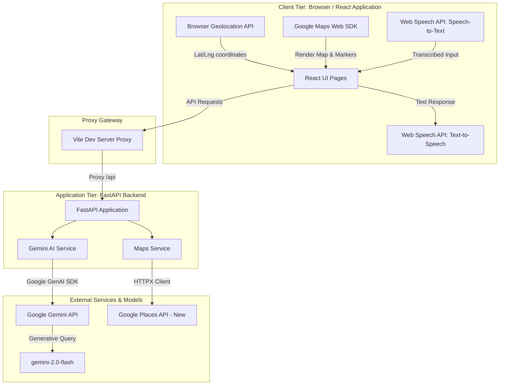
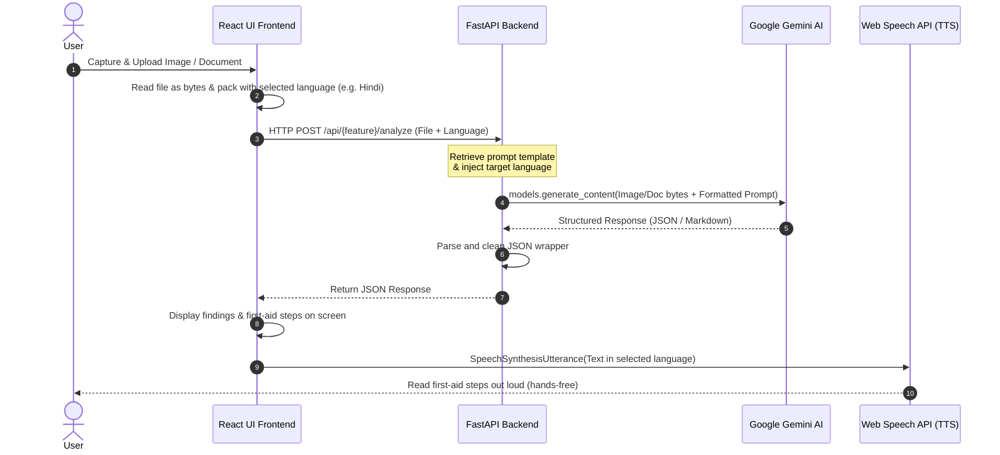
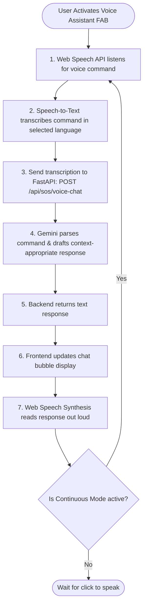
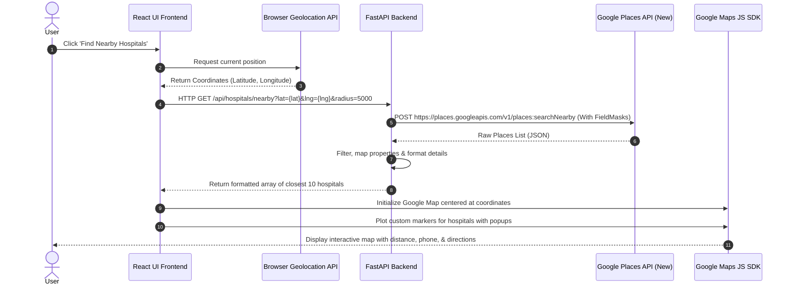

# 🛡️ AI LifeAssist

**Your Multimodal AI-Powered Emergency & Personal Safety Assistant**

AI LifeAssist is a multimodal Generative AI application designed to provide instantaneous first-aid guidance, medical information simplification, location services, and hands-free voice assistance during stressful health emergencies and daily medical situations. 


---

## 📖 Table of Contents
- [✨ Core Features & AI Capabilities](#-core-features--ai-capabilities)
- [🏗️ System Architecture](#️-system-architecture)
- [🛠️ Tech Stack](#️-tech-stack)
- [📁 Project Structure](#-project-structure)
- [🚀 Quick Start & Installation](#-quick-start--installation)
  - [Prerequisites](#prerequisites)
  - [1. Backend Setup](#1-backend-setup)
  - [2. Frontend Setup](#2-frontend-setup)
- [⚙️ Configuration Reference](#️-configuration-reference)
- [🔌 API Endpoints](#-api-endpoints)
- [🌐 Localization Support](#-localization-support)
- [🎯 Walkthrough & Demo Flow](#-walkthrough--demo-flow)
- [📞 Indian Emergency Numbers](#-indian-emergency-numbers)
- [⚠️ Medical Disclaimer](#️-medical-disclaimer)

---

## ✨ Core Features & AI Capabilities

| Feature | Description | Technical Implementation |
| :--- | :--- | :--- |
| 🚑 **Emergency Analyzer** | Upload pictures of injuries, wounds, or accidents to receive immediate first-aid instructions, danger signs, and critical dos/donts. | Multimodal Vision AI (`gemini-2.0-flash`) |
| 💊 **Medicine Explainer** | Take photos of medicine strips, bottles, or prescriptions to receive simple, plain-language details on uses, standard dosage guidelines, and side effects. | Multimodal Vision AI (`gemini-2.0-flash`) |
| 📄 **Report Summarizer** | Upload complex laboratory tests, blood panels, or radiology reports (PDF/images) to get a clear, jargon-free summary of findings. | Vision & Document AI (`gemini-2.0-flash`) |
| 🏥 **Hospital Finder** | Auto-detect location and find nearby hospitals, clinics, and emergency rooms with live mapping, directions, ratings, and phone numbers. | Google Maps Javascript + Places API (New) |
| 🆘 **SOS Generator** | Describe a critical situation (or press standard buttons) to generate a tailored emergency message containing precise GPS coordinates, ready to send. | Context-Aware Prompting (`gemini-2.0-flash`) |
| 🎙️ **Voice Assistant** | Complete hands-free dashboard interaction utilizing voice commands and voice responses for users who cannot interact physically. | Web Speech API + Gemini Chat Backend |
| 🌐 **Multilingual Hub** | Access the entire dashboard, AI responses, and spoken speech in 7 local Indian languages. | Multilingual Prompts (`gemini-2.0-flash`) |

---

## 🏗️ System Architecture & Workflow Diagrams

AI LifeAssist uses a decoupled client-server architecture. The frontend handles speech input/output, geolocation, mapping, and media captures, while the backend coordinates request processing with the Gemini AI models and the Google Maps API.

### 1. High-Level Component Architecture
This block diagram outlines the tiers and flow of data between the user interface, proxy gateways, internal FastAPI service layers, and external APIs.



### 2. Multimodal AI Analysis Pipeline
This sequence diagram shows the step-by-step processing of user-uploaded files (images/PDFs) through the backend for Emergency, Medicine, and Medical Report analysis features, culminating in automatic browser translation and voice playback.



### 3. Hands-Free Voice Assistant Loop
This flowchart describes the continuous feedback loop of the Voice Assistant, which allows users to interact with the system entirely by speaking.



### 4. Nearby Hospital Finder & Location Flow
This diagram details how the application fetches the user's geographic coordinates, queries the Google Places API (New) with detailed field masks, and renders the closest hospital locations on the map.



---

## 🛠️ Tech Stack

### Frontend
- **Framework**: [React 18](https://react.dev/) + [Vite](https://vitejs.dev/)
- **Styling**: Vanilla CSS with a responsive Glassmorphic Dark Design System
- **Icons**: [Lucide React](https://lucide.dev/)
- **Routing**: [React Router DOM v6](https://reactrouter.com/)
- **Voice System**: Web Speech API (`SpeechRecognition` & `SpeechSynthesis`) for browser-native translation and voice synthesis.
- **Client**: Axios for API interaction.

### Backend
- **Framework**: [FastAPI 0.115](https://fastapi.tiangolo.com/) (Asynchronous, high-performance web framework)
- **ASGI Server**: [Uvicorn](https://www.uvicorn.org/)
- **SDK**: [Google GenAI Python SDK](https://github.com/google/generative-ai-python) (`google-genai>=1.14.0`)
- **Config Management**: Pydantic Settings (Validation & Environment loading)
- **HTTP Client**: HTTPX (Asynchronous HTTP requests to the Google Places API)

---

## 📁 Project Structure

```
ai-lifeassist/
├── backend/
│   ├── app/
│   │   ├── __init__.py
│   │   ├── main.py              # Main FastAPI application entry & global error handlers
│   │   ├── config.py            # Environment configurations via Pydantic
│   │   ├── routers/             # API Router endpoints
│   │   │   ├── emergency.py     # Injury image processing routes
│   │   │   ├── hospitals.py     # Google Places hospital finding routes
│   │   │   ├── medicine.py      # Pill/Prescription explanation routes
│   │   │   ├── reports.py       # Laboratory report parsing routes
│   │   │   └── sos.py           # SOS Generation and Voice Assistant routes
│   │   ├── services/            # Core business logic
│   │   │   ├── gemini_service.py # Gemini Multimodal API caller and prompt formatter
│   │   │   └── maps_service.py  # Google Places API client with FieldMasks
│   │   └── prompts/
│   │       └── system_prompts.py # Fine-tuned system prompts for diagnostic instructions
│   ├── requirements.txt         # Backend Python packages
│   └── run.py                   # Dev-server starter script
│
├── frontend/
│   ├── src/
│   │   ├── pages/               # Route components
│   │   │   ├── Home.jsx         # Action dashboard & metrics
│   │   │   ├── Emergency.jsx    # First-aid analyzer screen
│   │   │   ├── Medicine.jsx     # Medicine explainer screen
│   │   │   ├── Reports.jsx      # Document upload & summary screen
│   │   │   ├── Hospitals.jsx    # Hospital Google Maps locator
│   │   │   └── SOS.jsx          # SOS panic button and messenger
│   │   ├── components/          # Reusable UI elements
│   │   │   ├── LanguageSelector/# Language picker component
│   │   │   └── VoiceAssistant/  # Interactive FAB voice assistant component
│   │   ├── hooks/               # Custom React hooks (e.g. useGeolocation.js)
│   │   ├── services/            # API client module
│   │   │   └── api.js           # Axios router calls mapping to FastAPI backend
│   │   ├── i18n/                # Translation system
│   │   │   └── translations.js  # Static dictionary containing interface keys in 7 languages
│   │   ├── styles/              # Design system styling files
│   │   │   └── index.css        # Global CSS rules, colors, transitions
│   │   ├── main.jsx             # React startup wrapper
│   │   └── App.jsx              # Navigation layout, paths, state wrapper
│   ├── package.json             # Frontend packages
│   └── vite.config.js           # Dev server config & proxy mappings
│
├── .gitignore
└── README.md                    # Project documentation (this file)
```

---

## 🚀 Quick Start & Installation

### Prerequisites
- **Python 3.10+** installed on your system.
- **Node.js 18+** installed on your system.
- **Google Gemini API Key**: Get a free API key at [Google AI Studio](https://aistudio.google.com).
- **Google Maps API Key**: Enable the Maps JavaScript API and Places API on [Google Cloud Console](https://console.cloud.google.com).

---

### 1. Backend Setup

1. **Navigate to the backend folder**:
   ```bash
   cd backend
   ```

2. **Create a virtual environment**:
   - Using standard `venv`:
     ```bash
     python -m venv venv
     # Activate on Windows (PowerShell):
     .\venv\Scripts\Activate.ps1
     # Activate on macOS/Linux:
     source venv/bin/activate
     ```
   - *Alternative (Faster)* using `uv`:
     ```bash
     uv venv
     .venv\Scripts\activate
     ```

3. **Install dependencies**:
   ```bash
   pip install -r requirements.txt
   ```

4. **Set up configurations**:
   Copy `.env.example` to `.env`:
   ```bash
   cp .env.example .env
   ```
   Open the `.env` file and insert your API credentials:
   ```env
   GEMINI_API_KEY=AIzaSy...your_gemini_api_key...
   GOOGLE_MAPS_API_KEY=AIzaSy...your_google_maps_api_key...
   ```

5. **Start the backend server**:
   ```bash
   python run.py
   ```
   - The backend runs by default at: `http://localhost:8000`
   - Detailed Swagger API documentation will be available at: `http://localhost:8000/docs`

---

### 2. Frontend Setup

1. **Navigate to the frontend folder**:
   ```bash
   cd ../frontend
   ```

2. **Install node dependencies**:
   ```bash
   npm install
   ```

3. **Set up configurations**:
   Copy `.env.example` to `.env`:
   ```bash
   cp .env.example .env
   ```
   Open the `.env` file and verify config settings:
   ```env
   VITE_API_URL=http://localhost:8000
   VITE_GOOGLE_MAPS_API_KEY=AIzaSy...your_google_maps_api_key...
   ```

4. **Start the development client**:
   ```bash
   npm run dev
   ```
   - The application will launch at: `http://localhost:5173`

---

## ⚙️ Configuration Reference

### Backend Settings (`backend/.env`)

| Variable | Type | Default | Description |
| :--- | :--- | :--- | :--- |
| `GEMINI_API_KEY` | String | `None` (Required) | API Key to authenticate requests sent to Google Gemini Models. |
| `GOOGLE_MAPS_API_KEY` | String | `None` (Required)| API Key for Google Places API (New) calls on the backend. |
| `GEMINI_MODEL` | String | `gemini-2.0-flash` | The specific Google Gemini model endpoint. |
| `CORS_ORIGINS` | List | `["http://localhost:5173"]` | Authorized origin ports allowed to access FastAPI routes. |

### Frontend Settings (`frontend/.env`)

| Variable | Type | Default | Description |
| :--- | :--- | :--- | :--- |
| `VITE_API_URL` | String | `http://localhost:8000` | The backend server endpoint. |
| `VITE_GOOGLE_MAPS_API_KEY` | String | `None` (Required) | Client API key for rendering interactive Google Maps inside the browser. |

---

## 🔌 API Endpoints

FastAPI exposes the following JSON endpoints:

| Endpoint | Method | Input Parameters | Output Content |
| :--- | :--- | :--- | :--- |
| `/api/emergency/analyze` | `POST` | `file`: Image File (multipart)<br>`language`: String (form-data) | JSON response containing: `severity`, `first_aid_steps` list, `danger_signs` warning, and localized textual explanation. |
| `/api/medicine/explain` | `POST` | `file`: Image File (multipart)<br>`language`: String (form-data) | JSON response describing active ingredients, usage description, safe dosage directions, and precautions. |
| `/api/reports/summarize` | `POST` | `file`: Document/Image (multipart)<br>`language`: String (form-data) | JSON response containing: `summary` overview, parsed key medical findings, metrics out of bounds, and recommended next steps. |
| `/api/hospitals/nearby` | `GET` | `lat`: Float (Query)<br>`lng`: Float (Query)<br>`radius`: Integer (Query, default 5000) | JSON array list of the 10 closest hospital locations, including names, coordinates, open-now status, phone numbers, and maps links. |
| `/api/sos/generate` | `POST` | `situation`: String (json)<br>`latitude`: Float (json)<br>`longitude`: Float (json)<br>`language`: String (json) | JSON response with a custom-generated template SOS message containing precise location parameters and context text. |
| `/api/sos/voice-chat` | `POST` | `message`: String (json)<br>`language`: String (json) | Simple text response representing the AI Voice Assistant's conversational reply. |
| `/` | `GET` | *None* | Health status check displaying active AI features. |
| `/health` | `GET` | *None* | System diagnostic check showing if the Gemini and Maps API keys are correctly loaded. |

---

## 🌐 Localization Support

AI LifeAssist breaks language barriers during emergencies. Selecting a language from the dashboard automatically translates the entire user interface and instructions the Gemini Model to explain/summarize in the chosen dialect.

The application fully supports:
* 🇬🇧 **English** (`en`)
* 🇮🇳 **Hindi / हिन्दी** (`hi`)
* 🇮🇳 **Tamil / தமிழ்** (`ta`)
* 🇮🇳 **Telugu / తెలుగు** (`te`)
* 🇮🇳 **Bengali / বাংলা** (`bn`)
* 🇮🇳 **Kannada / ಕನ್ನಡ** (`kn`)
* 🇮🇳 **Malayalam / Malayalam** (`ml`)

---

## 🎯 Walkthrough & Demo Flow

Here is a recommended **3-minute** validation flow to showcase the app:

1. **Dashboard & Localization (30 seconds)**:
   - Walk through the glassmorphic dark interface.
   - Switch language to **Hindi (हिन्दी)** or **Tamil (தமிழ்)** to demonstrate immediate sidebar translation.

2. **Emergency Analyzer (45 seconds)**:
   - Upload an injury image (e.g., scrape/burn).
   - The multimodal model returns clear structured steps: Severity Level, Immediate Actions, Things to Avoid, and Danger Signs.
   - The browser-native voice reads the steps aloud in the selected language.

3. **Medicine Explainer (45 seconds)**:
   - Upload a photo of a medicine strip (or generic prescription).
   - See the active ingredients list, generic name equivalents, and simplified usage guidelines instantly populated.

4. **Hospital Search (30 seconds)**:
   - Navigate to the **Hospitals** tab.
   - Grant geolocation permission to identify your coordinates.
   - Nearby hospitals are pulled from Google Places and rendered on the Google Map panel with phone click-to-call.

5. **SOS Emergency Panic Button (30 seconds)**:
   - Click the **SOS** tab (or the floating red button).
   - Enter a situation (e.g., *"chest pain and dizziness"*).
   - The engine automatically links the GPS location and outputs a readable emergency message ready to copy and send to emergency contacts.

---

## 📞 Indian Emergency Numbers

If you are facing a severe, life-threatening situation, please contact official services immediately:

| Department | Contact Number |
| :--- | :--- |
| **National Emergency Number (Unified)** | **112** |
| Police | 100 |
| Ambulance | 108 / 102 |
| Fire Brigade | 101 |
| Women Helpline | 1091 |
| Senior Citizen Helpline | 14567 |

---

## ⚠️ Medical Disclaimer

> [!CAUTION]
> **AI LifeAssist is an informational and educational tool only. It does not provide professional medical advice, clinical diagnoses, or official treatment recommendations.**
>
> 1. AI-generated evaluations (including first-aid instructions, medicine details, and medical report summaries) are based on probabilistic language models and may contain errors or omissions.
> 2. Always consult a qualified medical professional, doctor, or emergency medical technician (EMT) for official clinical guidance.
> 3. In the event of a severe, life-threatening emergency, always call official emergency numbers (like 112 or 108) immediately.
